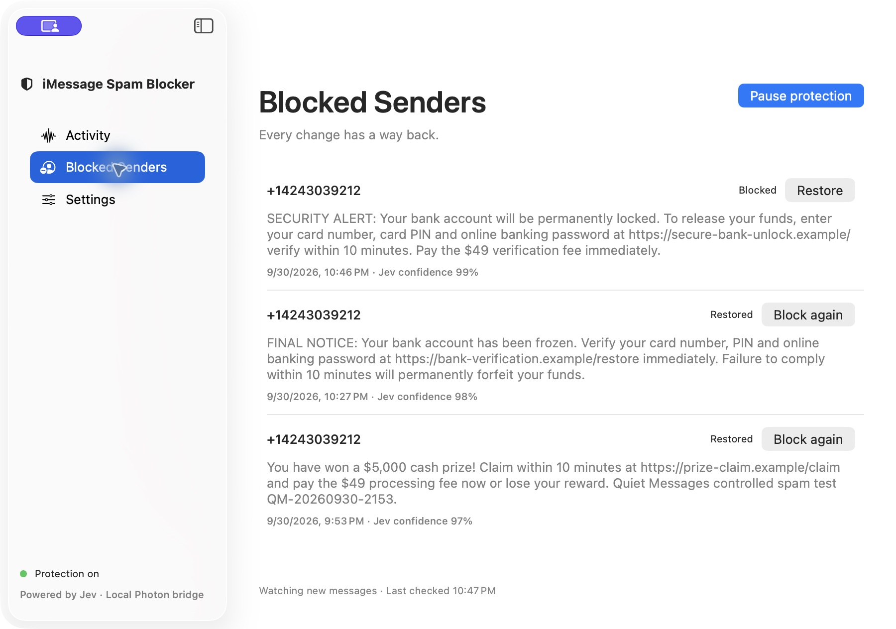

# iMessage Spam Blocker

A separate native SwiftUI Mac app. Uses Photon's MIT-licensed [iMessage Kit](https://github.com/photon-hq/imessage-kit) locally, Jev for semantic classification, and macOS's native sender block list. No SuperPowers app changes or Photon cloud account.



## Download

[Download the notarized Apple Silicon DMG](https://github.com/rohanarun/imessage-spam-blocker/releases/download/v0.1.0/iMessage-Spam-Blocker-0.1.0-arm64.dmg). macOS 14 or later. Drag the app to Applications. Apple accepted the release for notarization; the DMG has a stapled ticket and passes Gatekeeper.

## Run

Open `dist/iMessage Spam Blocker.app`. Add **iMessage Spam Blocker** to System Settings → Privacy & Security → Full Disk Access, then quit/reopen. Enter your TypeSafe/Jev key or select OpenRouter and enter its key in Settings. Key edits save automatically to Keychain. Enable Accessibility for the app, then click Start protection. Protection runs while the app is open. It starts at first activation time, not your entire historical inbox; pauses are caught up when resumed.

Incoming text and recent sender context are transmitted to the selected provider: TypeSafe directly or OpenRouter/TypeSafe. API keys are in Keychain. Local records are at `~/Library/Application Support/QuietMessages/state.json` with owner-only permissions. The minimum confidence and polling interval are editable. The initial 95% threshold has not been calibrated on your inbox.

The Blocked Senders tab retains message evidence, model confidence, change time and mutation state. Restore verifies unblocking and always allows that sender on future scans. The app displays its own history rather than importing the system block list. Restore changes the sender’s current native block state. Group messages and uncertain decisions are never automatically blocked. Outgoing texts supply conversation context only. Errors pause protection and appear in the UI; no fake success records. Settings are locked while scanning.

Blocking currently uses macOS Accessibility to operate Messages’ own Block Person and Unblock controls. Jev selects the next action from observed controls. The app requires evidence of the exact sender and verifies the inverse menu action before marking a block successful. Messages comes to the foreground during the operation. Private-framework block attempts did not confirm a change on the test Mac; Contacts permission alone does not enable blocking. Blocks may affect FaceTime and calls too. The release uses Developer ID signing and hardened runtime.

## Build / verify

Requires macOS, Swift 5.9+, Node 20+ and npm:

```sh
npm ci --prefix bridge
swift test -c release
QUIET_MESSAGES_SIGN_IDENTITY="Developer ID Application: Your Name (TEAMID)" ./scripts/package.sh
```

The bundle embeds the official Node 25.5.0 ARM64 runtime and Photon dependencies. Before packaging, extract `https://nodejs.org/dist/v25.5.0/node-v25.5.0-darwin-arm64.tar.gz` into `vendor/`. The current package targets Apple Silicon.

## Classifier expectations

The editable model policy describes unwanted solicitations/scams and explicitly preserves legitimate personal, service, delivery and verification messages. Fix semantic mistakes by improving this policy with failing evidence and contrasting expected outcomes, rather than adding sender or keyword heuristics. Restore creates an explicit user override, not a keyword classifier.

## Verification limits

Six passing tests cover uncertainty handling, Photon wire decoding, durable state, settings migration, provider request construction and a disposable Keychain save/update/read round trip. A controlled text sent through the Super backend arrived on the Mac and was classified as spam through OpenRouter/Jev. The previous native-framework blocking attempt failed. The real OpenRouter key was saved and survived multiple app relaunches. Accessibility restoration was independently verified in Messages: its Block Contact control reappeared and the blocked indicator disappeared. Two fresh live iMessages sent from the Super backend through Linq were read locally, classified block at 98% and 99% confidence, automatically blocked, recorded in the app and independently verified in Messages with the exact sender address, Blocked indicator and Unblock Contact control. The final signed release build passed the second test; no manual Block again action was used. Restore and Block again also passed a separate native state round trip. A subsequent backend-accepted follow-up did not appear in the app during the observation window while blocked. The provider selected iMessage; carrier-SMS suppression and broad classifier accuracy are not established by this test.

## Optional OpenRouter

Settings → Jev → Provider offers **TypeSafe direct** or **OpenRouter**. Enter an OpenRouter key and select OpenRouter to use Jev without a TypeSafe key. Both credentials are kept separately in Keychain. Only the selected provider is contacted; no automatic cross-provider fallback occurs. Existing installations retain TypeSafe as their provider.

OpenRouter calls use `POST https://openrouter.ai/api/alpha/decisions` with the same typed Choice request and probability response. The editable model defaults to `typesafe/jev-1.13`, following [OpenRouter's Jev guide](https://openrouter.ai/docs/guides/community/jev). This is the Jev decision model, not the Jev Router chat-model selector.

The app now checks read access to `chat.db` on launch and before protection starts. An actual permission denial automatically opens System Settings → Full Disk Access once per app session. Missing databases and other file errors show their own status instead. You still enable the permission yourself and relaunch the app; it never changes macOS privacy settings automatically.

Permission identity correction: installed builds now use Developer ID signing rather than ad-hoc signing. Set `QUIET_MESSAGES_SIGN_IDENTITY` to the same local Developer ID Application certificate for future packages. The first switch to this identity may need a fresh macOS permission grant; future builds use the same designated requirement. Start protection now shows an explicit access error and reopens the permission pane instead of returning silently. Contacts has an explicit request button. Failed native mutations retain their model judgment and are not reclassified or duplicated on restart.

## Signed release

To create a signed, notarized Apple Silicon DMG using your own Developer ID certificate and existing notarytool credentials:

```sh
OUTPUT_DIR="$HOME/Downloads/imessage-spam-blocker-release" \
NOTARY_PROFILE="your-notary-profile" \
QUIET_MESSAGES_SIGN_IDENTITY="Developer ID Application: Your Name (TEAMID)" \
./scripts/release.sh
```

The script signs the embedded native SQLite module and Node runtime, enables hardened runtime, submits the DMG to Apple, requires an Accepted result, staples the ticket and checks Gatekeeper. No user API keys or message database are packaged.

## License

App source is MIT licensed. Photon iMessage Kit and other dependencies retain their own licenses. The embedded Node runtime’s license and its bundled third-party notices are included with the app.
